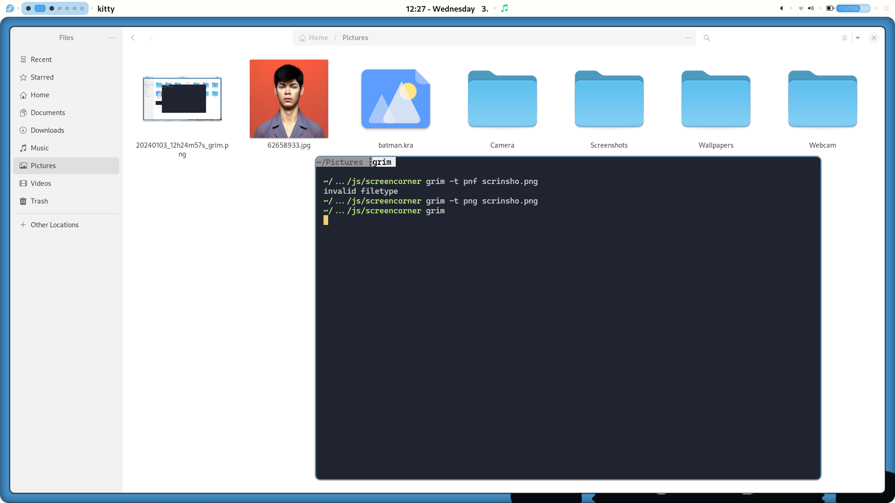

---

---
import Latex from '../components/Latex.astro'


# Titulo importante

## Titulo menos importante

    <Latex formula='x=\sqrt{4}'/> 

Here's a sentence with a footnote. [^1]

[^1]: This is the footnote.

```html


<div class="relative overflow-x-auto">
    <table class="w-full text-sm text-left rtl:text-right text-gray-500 dark:text-gray-400">
        <thead class="text-xs text-gray-700 uppercase bg-gray-50 dark:bg-gray-700 dark:text-gray-400">
            <tr>
                <th scope="col" class="px-6 py-3">
                    Product name
                </th>
                <th scope="col" class="px-6 py-3">
                    Color
                </th>
                <th scope="col" class="px-6 py-3">
                    Category
                </th>
                <th scope="col" class="px-6 py-3">
                    Price
                </th>
            </tr>
        </thead>
        <tbody>
            <tr class="bg-white border-b dark:bg-gray-800 dark:border-gray-700">
                <th scope="row" class="px-6 py-4 font-medium text-gray-900 whitespace-nowrap dark:text-white">
                    Apple MacBook Pro 17"
                </th>
                <td class="px-6 py-4">
                    Silver
                </td>
                <td class="px-6 py-4">
                    Laptop
                </td>
                <td class="px-6 py-4">
                    $2999
                </td>
            </tr>
            <tr class="bg-white border-b dark:bg-gray-800 dark:border-gray-700">
                <th scope="row" class="px-6 py-4 font-medium text-gray-900 whitespace-nowrap dark:text-white">
                    Microsoft Surface Pro
                </th>
                <td class="px-6 py-4">
                    White
                </td>
                <td class="px-6 py-4">
                    Laptop PC
                </td>
                <td class="px-6 py-4">
                    $1999
                </td>
            </tr>
            <tr class="bg-white dark:bg-gray-800">
                <th scope="row" class="px-6 py-4 font-medium text-gray-900 whitespace-nowrap dark:text-white">
                    Magic Mouse 2
                </th>
                <td class="px-6 py-4">
                    Black
                </td>
                <td class="px-6 py-4">
                    Accessories
                </td>
                <td class="px-6 py-4">
                    $99
                </td>
            </tr>
        </tbody>
    </table>
</div>

```
~~The world is flat.~~

That is so funny! :joy:

[Exampe Link](https://www.example.com)




<div class="flex items-center p-4 mb-4 text-sm text-blue-800 rounded-lg bg-blue-50 dark:bg-gray-800 dark:text-blue-400" role="alert">
  <svg class="flex-shrink-0 inline w-4 h-4 me-3" aria-hidden="true" xmlns="http://www.w3.org/2000/svg" fill="currentColor" viewBox="0 0 20 20">
    <path d="M10 .5a9.5 9.5 0 1 0 9.5 9.5A9.51 9.51 0 0 0 10 .5ZM9.5 4a1.5 1.5 0 1 1 0 3 1.5 1.5 0 0 1 0-3ZM12 15H8a1 1 0 0 1 0-2h1v-3H8a1 1 0 0 1 0-2h2a1 1 0 0 1 1 1v4h1a1 1 0 0 1 0 2Z"/>
  </svg>
  <span class="sr-only">Info</span>
  <div>
    <span class="font-medium">Info alert!</span> Change a few things up and try submitting again.
  </div>
</div>
<div class="flex items-center p-4 mb-4 text-sm text-red-800 rounded-lg bg-red-50 dark:bg-gray-800 dark:text-red-400" role="alert">
  <svg class="flex-shrink-0 inline w-4 h-4 me-3" aria-hidden="true" xmlns="http://www.w3.org/2000/svg" fill="currentColor" viewBox="0 0 20 20">
    <path d="M10 .5a9.5 9.5 0 1 0 9.5 9.5A9.51 9.51 0 0 0 10 .5ZM9.5 4a1.5 1.5 0 1 1 0 3 1.5 1.5 0 0 1 0-3ZM12 15H8a1 1 0 0 1 0-2h1v-3H8a1 1 0 0 1 0-2h2a1 1 0 0 1 1 1v4h1a1 1 0 0 1 0 2Z"/>
  </svg>
  <span class="sr-only">Info</span>
  <div>
    <span class="font-medium">Danger alert!</span> Change a few things up and try submitting again.
  </div>
</div>
<div class="flex items-center p-4 mb-4 text-sm text-green-800 rounded-lg bg-green-50 dark:bg-gray-800 dark:text-green-400" role="alert">
  <svg class="flex-shrink-0 inline w-4 h-4 me-3" aria-hidden="true" xmlns="http://www.w3.org/2000/svg" fill="currentColor" viewBox="0 0 20 20">
    <path d="M10 .5a9.5 9.5 0 1 0 9.5 9.5A9.51 9.51 0 0 0 10 .5ZM9.5 4a1.5 1.5 0 1 1 0 3 1.5 1.5 0 0 1 0-3ZM12 15H8a1 1 0 0 1 0-2h1v-3H8a1 1 0 0 1 0-2h2a1 1 0 0 1 1 1v4h1a1 1 0 0 1 0 2Z"/>
  </svg>
  <span class="sr-only">Info</span>
  <div>
    <span class="font-medium">Success alert!</span> Change a few things up and try submitting again.
  </div>
</div>
<div class="flex items-center p-4 mb-4 text-sm text-yellow-800 rounded-lg bg-yellow-50 dark:bg-gray-800 dark:text-yellow-300" role="alert">
  <svg class="flex-shrink-0 inline w-4 h-4 me-3" aria-hidden="true" xmlns="http://www.w3.org/2000/svg" fill="currentColor" viewBox="0 0 20 20">
    <path d="M10 .5a9.5 9.5 0 1 0 9.5 9.5A9.51 9.51 0 0 0 10 .5ZM9.5 4a1.5 1.5 0 1 1 0 3 1.5 1.5 0 0 1 0-3ZM12 15H8a1 1 0 0 1 0-2h1v-3H8a1 1 0 0 1 0-2h2a1 1 0 0 1 1 1v4h1a1 1 0 0 1 0 2Z"/>
  </svg>
  <span class="sr-only">Info</span>
  <div>
    <span class="font-medium">Warning alert!</span> Change a few things up and try submitting again.
  </div>
</div>
<div class="flex items-center p-4 text-sm text-gray-800 rounded-lg bg-gray-50 dark:bg-gray-800 dark:text-gray-300" role="alert">
  <svg class="flex-shrink-0 inline w-4 h-4 me-3" aria-hidden="true" xmlns="http://www.w3.org/2000/svg" fill="currentColor" viewBox="0 0 20 20">
    <path d="M10 .5a9.5 9.5 0 1 0 9.5 9.5A9.51 9.51 0 0 0 10 .5ZM9.5 4a1.5 1.5 0 1 1 0 3 1.5 1.5 0 0 1 0-3ZM12 15H8a1 1 0 0 1 0-2h1v-3H8a1 1 0 0 1 0-2h2a1 1 0 0 1 1 1v4h1a1 1 0 0 1 0 2Z"/>
  </svg>
  <span class="sr-only">Info</span>
  <div>
    <span class="font-medium">Dark alert!</span> Change a few things up and try submitting again.
  </div>
</div>


---

1. Hola
2. Como estas
3. Todo bien

I need to highlight these <mark>very important words</mark>.

- [x] Write the press release
- [ ] Update the website
- [ ] Contact the media


<div class="relative overflow-x-auto">
    <table class="w-full text-sm text-left rtl:text-right text-gray-500 dark:text-gray-400">
        <thead class="text-xs text-gray-700 uppercase bg-gray-50 dark:bg-gray-700 dark:text-gray-400">
            <tr>
                <th scope="col" class="px-6 py-3">
                    Product name
                </th>
                <th scope="col" class="px-6 py-3">
                    Color
                </th>
                <th scope="col" class="px-6 py-3">
                    Category
                </th>
                <th scope="col" class="px-6 py-3">
                    Price
                </th>
            </tr>
        </thead>
        <tbody>
            <tr class="bg-white border-b dark:bg-gray-800 dark:border-gray-700">
                <th scope="row" class="px-6 py-4 font-medium text-gray-900 whitespace-nowrap dark:text-white">
                    Apple MacBook Pro 17"
                </th>
                <td class="px-6 py-4">
                    Silver
                </td>
                <td class="px-6 py-4">
                    Laptop
                </td>
                <td class="px-6 py-4">
                    $2999
                </td>
            </tr>
            <tr class="bg-white border-b dark:bg-gray-800 dark:border-gray-700">
                <th scope="row" class="px-6 py-4 font-medium text-gray-900 whitespace-nowrap dark:text-white">
                    Microsoft Surface Pro
                </th>
                <td class="px-6 py-4">
                    White
                </td>
                <td class="px-6 py-4">
                    Laptop PC
                </td>
                <td class="px-6 py-4">
                    $1999
                </td>
            </tr>
            <tr class="bg-white dark:bg-gray-800">
                <th scope="row" class="px-6 py-4 font-medium text-gray-900 whitespace-nowrap dark:text-white">
                    Magic Mouse 2
                </th>
                <td class="px-6 py-4">
                    Black
                </td>
                <td class="px-6 py-4">
                    Accessories
                </td>
                <td class="px-6 py-4">
                    $99
                </td>
            </tr>
        </tbody>
    </table>
</div>


|Tipo de texto o género discursivo|Clase de texto o género textual|Intención comunicativa|Tramas|
|---|---|---|---|
|Literario|Cuento, leyenda, novela, poema, fábula, mito, anécdota, historieta, parábola, piezas teatrales, etc.|Producir placer estético|Narrativa, descriptiva, dialogada o conversacional, monologada.|
|Informativo periodístico|Noticia, crónica, entrevista, reportaje breve, etc.|Brindar información sobre acontecimientos y hechos de la actualidad.|Explicativa o expositiva, dialogada, narrativa, descriptiva.|
|Informativo científico|Monografía, relato histórico, texto de divulgación científica, nota de enciclopedia|Informar sobre el conocimiento de las cosas explicando sus principios y causas.|Explicativa, descriptiva.|
|Informativo expositivo|Textos escolares o didácticos, fuentes de información de las áreas de Matemáticas, Ciencias Naturales, Ciencias Sociales, etc.|Brindar información sobre determinados fenómenos: los definen, describen, explican, ejemplifican.|Explicativa, descriptiva.|
|Argumentativo|Anuncio publicitario, ensayo, artículo de opinión, editorial, afiche, horóscopo.|Persuadir y convencer para la compra de un producto o servicio determinado. Defender una tesis con argumentos, ideas, opiniones.|Argumentativa, explicativa, descriptiva.|
|Instrumental|Acta, cheque, pagaré, convocatoria, informe, contrato, recibo, factura, etc.|Organizar y registrar actividades administrativas y comerciales.|Narrativa, explicativa, descriptiva.|
|Epistolar|Carta, telegrama, tarjeta, solicitud, nota, esquela, correo electrónico, etc.|Comunicarse con personas por medio de un mensaje escrito.|Narrativa, argumentativa.|
|Instruccional|Receta de cocina, consigna, instructivo, prospecto, reglamentos, leyes, etc.|Instruir y orientar para realizar actividades diversas.|Descriptiva.|
|Humorístico|Chiste, caricatura, grafiti, historieta.|Producir un efecto cómico por el juego deliberado con las palabras y las imágenes.|Narrativa, dialogada.|
